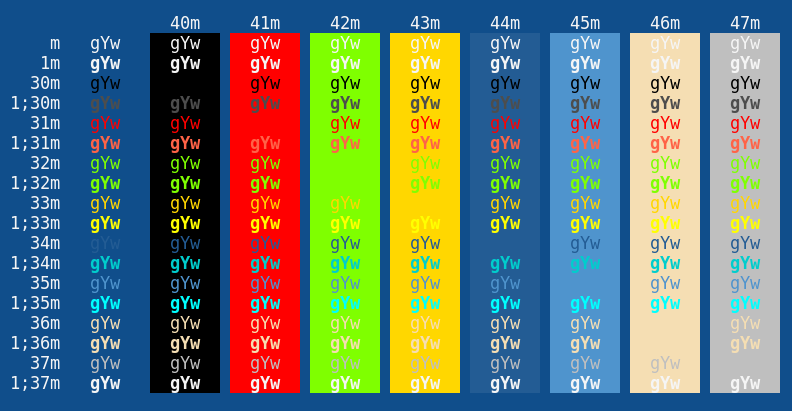

# Blue Mood for Xresources

This is a port of [emacs's Blue Mood theme](https://emacsthemes.com/themes/blue-mood-theme.html) for KDE's terminal emulator, Konsole.

## Installation

Copy the blue-mood.colorscheme file to `~/.local/share/konsole`.

## Activation

From Konsole, go the Settings toolbar item, and from there choose `Edit current profile`. Afterwards, go to the `Appearance` tab and choose the theme called `Blue Mood`.
